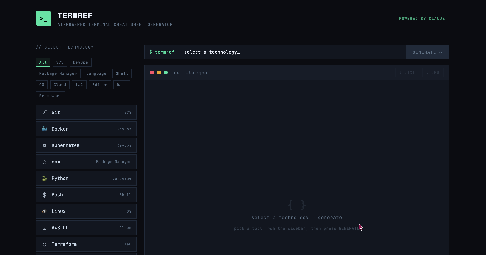
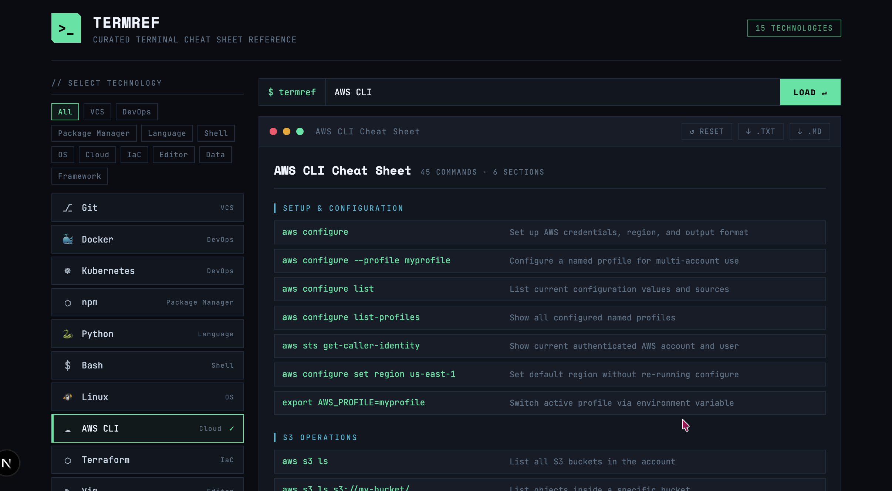

<div align="center">

# >_ TERMREF

**AI-powered terminal cheat sheet generator**

Pick a technology. Hit generate. Get a clean, downloadable reference card — powered by Claude.



<br><br>

[](https://nextjs.org)
[](https://react.dev)
[](https://typescriptlang.org)
[](https://docs.anthropic.com)
[](https://upstash.com)
[](LICENSE)

</div>

---

## Features

<div align="center">



<br><br>

</div>

- **15+ technologies** — Git, Docker, Kubernetes, Python, Bash, AWS CLI, Terraform, Vim, dbt, and more
- **Category filtering** — browse by DevOps, Language, Cloud, Data, etc.
- **One-click generation** — select a tool, press Generate, get a structured cheat sheet in seconds
- **Download as .TXT or .MD** — export for offline use or paste into docs
- **Server-side API key** — your Anthropic key never touches the browser
- **Terminal-inspired UI** — dark theme, monospace fonts, zero fluff

## Security

- **Server-side allowlist** — only the 15 known technology labels are accepted; arbitrary input is rejected with a `400` before reaching the AI
- **Rate limiting** — per-IP sliding window (10 req / 60s) via Upstash Redis, with proper `429` responses and `Retry-After` headers
- **No prompt injection** — the user message sent to Claude is constructed entirely from the validated allowlist, not from free-text input
- **Graceful fallback** — rate limiting is optional; without Upstash credentials the API runs unthrottled (safe for local dev)

## Supported Technologies

<p>
  
  
  
  
  
  
  
  
  
  
  
  
  
  
  
</p>

## Tech Stack

| Layer | Tech | |
|-------|------|---|
| Framework | Next.js 16 (App Router) |  |
| UI | React 19 + custom CSS |  |
| Fonts | JetBrains Mono, Space Mono |  |
| AI | Claude API (Anthropic) |  |
| Rate Limiting | Upstash Redis |  |
| Language | TypeScript 5 |  |
| Package Manager | pnpm |  |

## Getting Started

### Prerequisites

- 
-  (or npm / yarn)
- An [Anthropic API key](https://console.anthropic.com)
- *(Optional)* An [Upstash Redis](https://console.upstash.com) instance for rate limiting

### Setup

```bash
# clone the repo
git clone https://github.com/your-username/termref.git
cd termref

# install dependencies
pnpm install

# create your env file
cp .env.example .env
```

Add your API key to `.env`:

```env
ANTHROPIC_API_KEY=sk-ant-...

# Optional — enables rate limiting in production
UPSTASH_REDIS_REST_URL=https://...
UPSTASH_REDIS_REST_TOKEN=AX...
```

### Run

```bash
pnpm dev
```

Open [http://localhost:3000](http://localhost:3000).

## Project Structure

```
termref/
├── app/
│   ├── api/generate/route.ts   # Anthropic API proxy (allowlist + rate limit)
│   ├── components/
│   │   └── termref-app.tsx      # Main client component
│   ├── globals.css              # Reset
│   ├── termref.css              # Terminal theme styles
│   ├── layout.tsx               # Root layout + fonts
│   └── page.tsx                 # Entry page
├── docs/
│   ├── termref-aws.png          # README screenshot (generated sheet)
│   └── termref-empty-state.png  # README screenshot (empty state)
├── lib/
│   ├── cheat-sheet.ts           # JSON parser + text formatter
│   ├── rate-limit.ts            # Upstash rate limiter (optional)
│   └── technologies.ts          # Shared tech list + allowlist validator
├── .env.example
└── package.json
```

## Environment Variables

| Variable | Required | Description |
|----------|----------|-------------|
| `ANTHROPIC_API_KEY` | Yes | Anthropic API key (server-side only) |
| `UPSTASH_REDIS_REST_URL` | No | Upstash Redis URL — enables rate limiting |
| `UPSTASH_REDIS_REST_TOKEN` | No | Upstash Redis token — enables rate limiting |

> **Tip:** On Vercel, add Upstash via **Storage** → **Marketplace** → **Upstash for Redis**. The env vars are injected automatically.

---

<div align="center">

**Built with**  **+**  **+** 

MIT License

</div>
